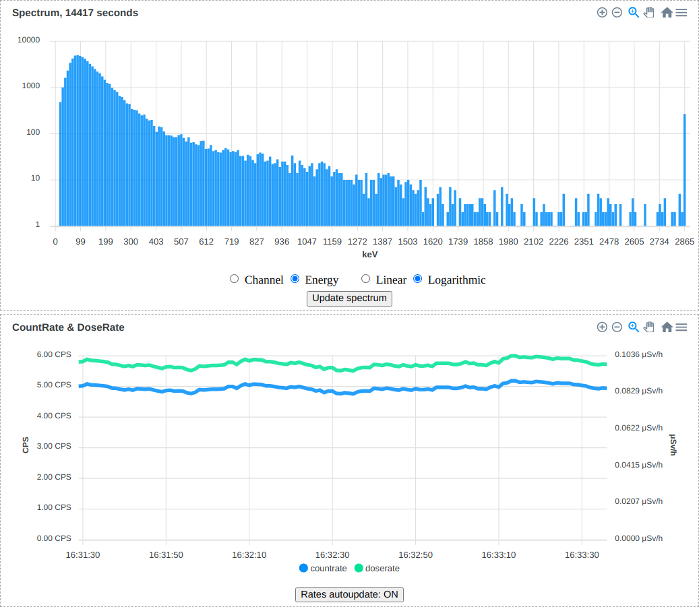

## RadiaCode

[Описание на русском языке](README_ru.md)

This is a library to work with the radiation detector and spectrometer [RadiaCode-101](https://scan-electronics.com/dosimeters/radiacode/radiacode-101).

***The project is still under development and not stable. Thus, the API might change in the future.***

Example project ([backend](radiacode-examples/webserver.py), [frontend](radiacode-examples/webserver.html)):


### Installation and example projects
```
# install library together with all the dependencies for the examples, remove [examples] if you don't need them
$ pip3 install 'radiacode[examples]' --upgrade

# launch the webserver from the screenshot above
# bluetooth: replace with the address of your device
$ python3 -m radiacode-examples.webserver --bluetooth-mac 52:43:01:02:03:04
# or the same, but via usb
$ sudo python3 -m radiacode-examples.webserver

# simple example for outputting information to the terminal, options are similar to the webserver example
$ python3 -m radiacode-examples.basic

# send data to the public monitoring project narodmon.ru
$ python3 -m radiacode-examples.narodmon --bluetooth-mac 52:43:01:02:03:04
```

### Development
- install [python poetry](https://python-poetry.org/docs/#installation)
- clone this repository
- install and run:
```
$ poetry install
$ poetry run python3 radiacode-examples/basic.py --bluetooth-mac 52:43:01:02:03:04 # or without --bluetooth-mac for USB connection
```
