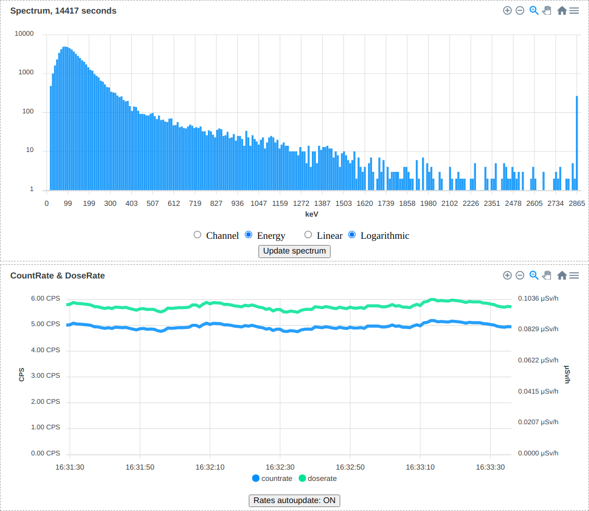

# RadiaCode Python Library

[](https://pypi.org/project/radiacode)
[](https://www.python.org/downloads/)
[](https://opensource.org/licenses/MIT)

Python library for interfacing with the [RadiaCode-10x](https://www.radiacode.com/) radiation detectors and spectrometers. Control your device, collect measurements, and analyze radiation data with ease.

## 🚀 Features

- 📊 Real-time radiation measurements
- 📈 Spectrum acquisition and analysis
- 🔌 USB and Bluetooth connectivity
- 🌐 Web interface example included
- 📱 Device configuration management

## 📸 Demo

Interactive web interface example ([backend](src/radiacode/examples/webserver.py) | [frontend](src/radiacode/examples/webserver.html)):



## 🎮 Quick Start

### Examples
```bash
pip install --upgrade 'radiacode[examples]'
```

Run the web interface shown in the screenshot above:
```bash
# Via Bluetooth (use the device's MAC address, or its CoreBluetooth UUID on macOS)
$ python3 -m radiacode.examples.webserver --bluetooth-mac 52:43:01:02:03:04

# Via USB connection (Linux/macOS/Windows)
$ sudo python3 -m radiacode.examples.webserver
```

Basic terminal output example (same options as web interface):
```bash
$ python3 -m radiacode.examples.basic
```

### Library Usage Example
```bash
pip install --upgrade radiacode
```
```python
from radiacode import RadiaCode, RealTimeData

# Connect to the device over USB and release it when finished
with RadiaCode() as device:
    # Get current radiation measurements
    data = device.data_buf()
    for record in data:
        if isinstance(record, RealTimeData):
            print(f"Dose rate: {record.dose_rate}")

    # Get spectrum data
    spectrum = device.spectrum()
    print(f"Live time: {spectrum.duration}s")
    print(f"Total counts: {sum(spectrum.counts)}")

    # Configure device
    device.set_display_brightness(5)  # 0-9 brightness level
    device.set_language('en')        # 'en' or 'ru'
```

#### More Features
```python
# Bluetooth connection (use the device's CoreBluetooth UUID on macOS)
device = RadiaCode(bluetooth_mac="52:43:01:02:03:04")

# Connect to specific USB device
device = RadiaCode(serial_number="YOUR_SERIAL_NUMBER")

# Energy calibration
coefficients = device.energy_calib()
print(f"Calibration coefficients: {coefficients}")

# Reset accumulated data
device.dose_reset()
device.spectrum_reset()

# Configure device behavior
device.set_sound_on(True)
device.set_vibro_on(True)
device.set_display_off_time(30)  # Auto-off after 30 seconds
```

## 🔧 Development Setup
1. Install prerequisites:
   ```bash
   # Install uv
   curl -LsSf https://astral.sh/uv/install.sh | sh
   ```

2. Clone
   ```bash
   git clone https://github.com/cdump/radiacode.git
   cd radiacode
   ```

3. Run examples:
   ```bash
   uv run python radiacode.examples/basic.py
   ```

## ⚠️ Platform-Specific Notes

### macOS
- ✅ USB connectivity works out of the box
- ✅ Bluetooth connectivity supported via Bleak (use the device's CoreBluetooth UUID)
- 📝 Required: `brew install libusb`

### Linux
- ✅ Both USB and Bluetooth fully supported
- 📝 Required: `libusb` and BlueZ
- 🔑 May need [udev rules](radiacode.rules) for USB access without root

### Windows
- ✅ USB connectivity supported
- ✅ Bluetooth connectivity supported via Bleak
- 📝 Required: USB drivers

## License

This project is licensed under the MIT License - see the [LICENSE](LICENSE) file for details.
